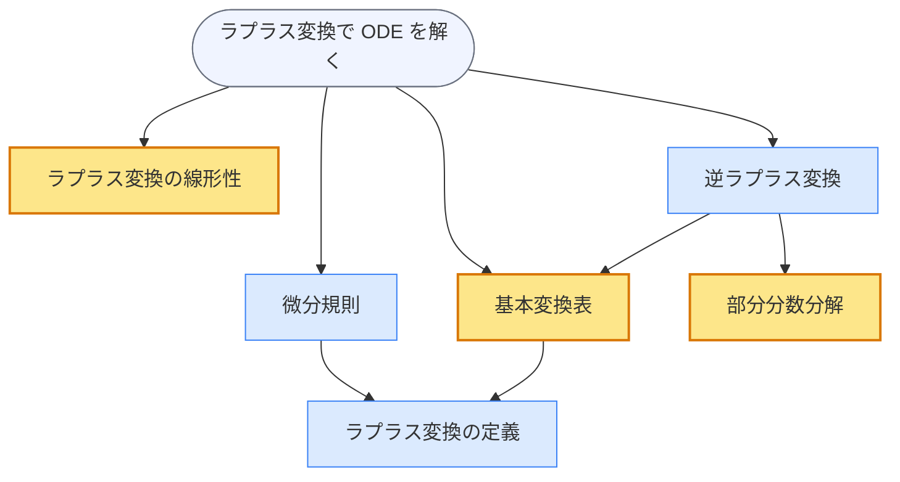

# benkyo（勉強）

[](https://pypi.org/project/benkyo/)
[](https://pypi.org/project/benkyo/)
[](https://opensource.org/licenses/MIT)

> [English version / 英語版 README](./README.md)

**シラバスを見失わずに、深く学べる。**

過去問・教科書・シラバスを Claude Code に渡すと、benkyo がそれらを「記憶を持つ個別指導教師」に変えます。どの概念を深く理解すべきか、どれはツールとして使うだけでよいか、試験まであとどれくらいか——それをすべて記憶し続けます。

AI に勉強を手伝ってもらうと、次々と「なぜ？」が生まれ、気づけば 1 時間後には前提知識の前提知識まで掘り下げていて、本来の試験範囲に戻れるかどうかわからなくなる——構造がなければ AI 個別指導は漂流します。

benkyo は依存関係マップを常に可視化します。何を深く理解するか、何をツールとして使うかはあなたが決める。どれだけ深く掘り下げても、目標への道は消えません。

## 動作デモ

> *初回セッション。講義ノートと練習問題を渡した直後:*

```
Claude: 目標は「ラプラス変換で y'' + 3y' + 2y = e^(-t) を解く」ですね。
        「使えればいい」とのことなので、実践から入りましょう。
        まず確認: ∫₀^∞ e^(-st) dt はいくつになりますか？

あなた: 1/s ですか？指数関数が 0 に減衰するので。

Claude: 正解です——その積分がラプラス変換の定義そのものです。
        では ODE の両辺に L{} を適用してみてください。
        y'' の項はどうなりますか？

あなた: L{y''} = s²Y(s) − sy(0) − y'(0) … 初期条件を入れると s²Y − 1 です。

Claude: そうです。Y(s) について解いて、部分分数は参照表を使ってください。
        計算してみてください——代数は確認します。
```

チューターはデータベースからプロジェクトの状態を読み込み、2 問で習熟度を判定し、問題を手渡します——部分分数はツール扱い（グラフで amber 表示）なので、導出ではなく表を渡しました。

いつでもマップを確認できます（`全体見せて` / `show me the map`）:



**青** = 理由まで理解する（導出・証明）。**黄** = 公式を使う（ツール）。**灰** = 試験の目標問題。前提知識に深く踏み込んでも、マップは消えません——今どこにいて、あとどれだけ残っているか、常に見えています。

または自分でコマンドを叩くこともできます:

```bash
benkyo render --project prj1 --format mermaid
benkyo render --project prj1 --format dot | dot -Tpng > graph.png
```

## はじめ方

**β 版** — CLI とスキルは英語ですが、日本語でのやり取りが唯一の評価済みエンドツーエンドパスです。エージェントは実行時に学習者の言語に合わせて応答します。

**→ [環境別セットアップガイド（macOS / Windows / Debian）](./SETUP/OVERVIEW.md)**

### クイックスタート — CLI モード

```bash
# 1. CLI をインストール
uv tool install benkyo   # または: pipx install benkyo
benkyo --version

# 2. スキルをインストール（Claude Code 内で）
/plugin marketplace add serkenn/remote-benkyo
/plugin install benkyo
```

Claude Code を再起動すると、`/help` に 5 つのスキルが表示されます。

**その他のエージェント**（OpenAI Codex CLI・Cursor・Gemini CLI・VS Code Copilot）: `SKILL.md` ファイルはオープンな [Agent Skills](https://agentskills.io/) フォーマットを使用しています。Codex CLI では `codex plugin marketplace add serkenn/remote-benkyo` 後にプラグインディレクトリからインストールします。Cursor や他のエージェントでは、スキルローダーを `.claude/skills/benkyo-*` に向けてください。リポジトリには Codex 用の `.codex-plugin/plugin.json` と、それ以外向けの `.claude/skills/` が同梱されています。

### クイックスタート — Web クライアント（iPad・ブラウザから使う）

1 コマンドでフルスタックを立ち上げ、LAN 内の任意のデバイスからアクセスできます:

```bash
docker compose up -d
# → http://<サーバーIP>:3000
```

外出先から HTTPS アクセスするには、**設定（⚙️）** ページで Cloudflare Tunnel トークンを入力してください——`cloudflared` コンテナが自動起動し、ポート開放は不要です。詳細は [SETUP/OVERVIEW.md](./SETUP/OVERVIEW.md) を参照してください。

### 教材を用意して開始

Claude Code を起動したディレクトリに、過去問・教科書 PDF・シラバス・講義ノートなどを置いて、話しかけるだけです:

```
あなた: ECE 220（信号とシステム）の過去 5 年分の期末試験・教科書 PDF・シラバスがあります。
        試験は 12 日後です。対策を手伝ってください。
```

`benkyo-project-init` が教材を読み込み、概念の依存関係グラフを構築し、過去問を目標問題に変換し、最初の「理解の深さの切り分け」（どの概念を導出するか、どれをツールとして使うか）を提案して確認を求め、個別指導に引き渡します。

## 仕組み

2 つの部品が連携して動作します:

1. **`benkyo` CLI** — Python ツール（Click + SQLite + platformdirs）。概念の依存関係グラフ・各プロジェクトでの概念ごとの理解の深さの決定・目標問題・追記専用のイベントログ・プロジェクトメタデータを管理します。セッションをまたいで共有されます。
2. **5 つのエージェントスキル** — `SKILL.md` 形式のプレイブック。エージェントがいつ・どのように CLI を操作するかを指示します。あなたは自然言語で話すだけ——エージェントが CLI 操作に変換し、公開済みのメタ分析に基づいたルールを適用します。学習者が `benkyo` と直接打つ必要はありません。

### 5 つのスキル

| スキル | 起動トリガー | 動作 |
|---|---|---|
| `benkyo-project-init` | 「○○を勉強したい」/ 教材共有 / 長期間ぶりの再開 | 教材を読み込み、概念グラフを構築し、初期の理解の深さを設定 |
| `benkyo-tutoring` | セッション中——「分からない」「教えて」「次」「分かった」 | 問題先行または説明先行モード・ブレークダウンプロトコル・自己評価の処理 |
| `benkyo-treatment-shift` | 「ちゃんと理解したい」（深く）/ 「公式でいい」（ツール扱い）/ 疲労・転移失敗の検出 | 概念の理解の深さを変更。深くする前に前提知識の存在を確認 |
| `benkyo-graph-edit` | 「これも追加して」「これは別物」/ グラフにない概念が会話に登場 | 同一性チェック付きでノードとエッジを追加。粒度の判断も担当 |
| `benkyo-session-wrap` | 「終わり」「また明日」「疲れた」/ 自然な区切りの検出 | 振り返り・遅延 JOL 記録・`benkyo session end` による原子的な永続化 |

各 `SKILL.md` は `.claude/skills/_benkyo-shared/references/` の共有ライブラリを参照しています——判断テーブル・自然言語↔内部語彙マップ・文献ポインタが含まれています。（`_` で始まるファイルは Claude Code がスキルとして読み込まないため、バンドルがクリーンに保たれます。）

### アーキテクチャ

```
学習者（自然言語）
      ↓ ↑
Claude Code  ← 説明文によるスキル自動起動
      ↓ ↑
  SKILL.md  → references/（判断テーブル・NL-to-CLI マップ・文献ポインタ）
      ↓
 benkyo CLI（読み書き）
      ↓
 SQLite DB
```

**ドメインモデル:**

- `concept_nodes`（`c1`, `c2`, …）— グローバル、プロジェクト間で共有。`name`（図表用の短いラベル）と `content`（定義）を持つ
- `problem_nodes`（`p1`, `p2`, …）— 同じくグローバル
- `edges` — `prereq`（有向: X は Y に依存）または `related`（無向破線: 混同しやすい・共起するペア）
- `projects`（`prj1`, …）— 目標問題と自由記述メタデータを保有
- `project_concepts` — プロジェクトごとの理解の深さ: `blackbox`（ツールとして使う）/ `whitebox`（理由まで理解する）/ 未設定 → デフォルト whitebox
- `events` — 追記専用ログ: `session_start`, `session_end`, `delayed_jol_recorded`, `hypercorrection_detected`, `treatment_changed`, `concept_probed`

**ウィンドウ**は目標問題から prereq エッジを BFS することで計算されます。blackbox 概念はトラバーサルを終了させます（チューターが教える必要がある範囲を限定する）。`--scope project` は目標 ∪ 明示的に設定した概念から BFS を開始し blackbox 終了なし——プロジェクト全体のフットプリントを表示します。`--scope graph` はグローバルグラフ全体を表示します。

> **用語について。** 内部用語 *whitebox*（理由まで理解する）と *blackbox*（ツールとして使う）は学習者に見せる表現には一切登場しません。スキルが実行時に学習者の自然言語に翻訳します。研究文献では Hiebert & Lefevre（1986）の「概念的知識」と「手続き的知識」にそれぞれ対応します。

## なぜこのように設計されているのか

各ルールは公開済みの研究結果を引用しています。行動ルールが（モデルの重みに暗黙的に埋め込まれているのではなく）`SKILL.md` ファイルに明示的に記述されているため、チューターの振る舞いは予測可能・監査可能です。

| ルール | 出典 |
|---|---|
| 理解すべき概念には問題先行、ツール概念には説明先行 | Sinha & Kapur（2021）|
| 模範解答ではなく学習者自身の試みに基づいて指導を組み立てる | Sinha & Kapur（2021）: 指導あり g = 0.56 vs なし g = 0.20（サブグループ p = .02）|
| 習熟度が上がるにつれてスキャフォールディングを減らす | Kalyuga（2007）、専門性逆転効果 |
| 長い事前テストではなく素早い第一ステップ診断 | Kalyuga（2007）、r 最大 0.92 |
| セッション終了時に遅延確信度チェックを求め、次回セッション開始時に確認 | Rhodes & Tauber（2011）、Hedges's g = 0.93（遅延 vs 即時）|
| 模範解答を見せる前に短い予測時間を設ける | Bjork et al.（2013）; Kornell et al.（2009）|
| プローブは偶発的に提示——「テスト」とは言わない | Bertsch et al.（2007）、d = 0.65 vs 0.32 |
| セッション内で関連概念をインターリーブする | Brunmair & Richter（2019）|
| 高確信度の誤答には明示的な対比修正 | Butterfield & Metcalfe（2001）、hypercorrection |
| 意図する使用法に合わせたプローブ形式（TAP）| Adesope et al.（2017）、g = 0.63 vs 0.53 |
| 学習者の自己評価は信頼性の低い証拠として扱う | Bjork et al.（2013）、3 つのバイアス |

## 制限事項

- **日本語ファーストの評価**: `SKILL.md` ファイルは英語（どのエージェントも読める）ですが、トリガーフレーズ・評価プロンプト・主要語彙の例は日本語ファーストです。Claude / Codex は実行時に学習者の言語に合わせるため英語話者も今日から使えますが、形式評価されているのは日本語のエンドツーエンドの挙動のみです。ローカライズされた例セットのコントリビューションを歓迎します。
- **確率的学習者モデルなし**: benkyo は「イベントをクエリできる」段階で止まっています。P（習得済み）の計算（BKT）も、忘却モデルに基づく復習スケジューリング（FSRS）も行いません。スキルはシンプルなヒューリスティックでイベントログをクエリします。モデルが必要な場合は、イベントログの上に別レイヤーとして構築してください。
- **自己管理型スケジューリング**: 間隔学習の推奨はセッションラップのヒューリスティックによるものであり、カードごとの忘却モデルによるキューではありません。Adesope の 1〜6 日ウィンドウは学習者へのヒントであり、キューではありません。
- **二層構造の脆弱性**: CLI のインターフェースが変わってスキルのチートシートが更新されなければ、スキルの呼び出しが失敗します。変更時はテストスイートとスキル評価を一緒に実行してください。`benkyo schema` でスキルがライブ CLI の形状をイントロスペクトできます。
- **クロスエージェントの動作は未検証**: 評価は Claude Code のみで実施されました。Codex CLI のインストールパスは設定されていますが、実際の Codex セッションでの動作検証はされていません。Cursor / Gemini CLI / VS Code Copilot は原理的には動きますが、同様に未検証です。クロスエージェントの動作を確認・修正する PR を歓迎します。

## 開発

```bash
uv sync --dev
uv run pytest                       # 192 テスト
benkyo --help
benkyo schema                       # CLI 全体の JSON ツリー
```

スキルファイルは `.claude/skills/benkyo-*/SKILL.md` にあります。各スキルには `evals/evals.json`（シングルターン 3 シナリオ）と `evals/trigger-eval.json`（トリガー識別 16 ケース）があります。`_benkyo-shared/evals/TRIGGER-OPTIMIZATION.md` を参照して `example-skills:skill-creator` の `run_loop.py` で実行してください。

完全な CLI リファレンスは `.claude/skills/_benkyo-shared/references/cli-cheatsheet.md` にあります——または `benkyo --help` / `benkyo schema` を実行してください。

## 参考文献

Adesope, O. O., Trevisan, D. A., & Sundararajan, N. (2017). Rethinking the use of tests: A meta-analysis of practice testing. *Review of Educational Research*, *87*(3), 659–701. <https://doi.org/10.3102/0034654316689306>

Bertsch, S., Pesta, B. J., Wiscott, R., & McDaniel, M. A. (2007). The generation effect: A meta-analytic review. *Memory & Cognition*, *35*(2), 201–210. <https://doi.org/10.3758/BF03193441>

Bjork, R. A., & Bjork, E. L. (1992). A new theory of disuse and an old theory of stimulus fluctuation. In A. F. Healy, S. M. Kosslyn, & R. M. Shiffrin (Eds.), *From learning processes to cognitive processes: Essays in honor of William K. Estes* (Vol. 2, pp. 35–67). Erlbaum.

Bjork, R. A., Dunlosky, J., & Kornell, N. (2013). Self-regulated learning: Beliefs, techniques, and illusions. *Annual Review of Psychology*, *64*, 417–444. <https://doi.org/10.1146/annurev-psych-113011-143823>

Brunmair, M., & Richter, T. (2019). Similarity matters: A meta-analysis of interleaved learning and its moderators. *Psychological Bulletin*, *145*(11), 1029–1052. <https://doi.org/10.1037/bul0000209>

Butterfield, B., & Metcalfe, J. (2001). Errors committed with high confidence are hypercorrected. *Journal of Experimental Psychology: Learning, Memory, and Cognition*, *27*(6), 1491–1494. <https://doi.org/10.1037/0278-7393.27.6.1491>

Kalyuga, S. (2007). Expertise reversal effect and its implications for learner-tailored instruction. *Educational Psychology Review*, *19*(4), 509–539. <https://doi.org/10.1007/s10648-007-9054-3>

Murre, J. M. J., & Dros, J. (2015). Replication and analysis of Ebbinghaus' forgetting curve. *PLOS ONE*, *10*(7), e0120644. <https://doi.org/10.1371/journal.pone.0120644>

Rhodes, M. G., & Tauber, S. K. (2011). The influence of delaying judgments of learning on metacognitive accuracy: A meta-analytic review. *Psychological Bulletin*, *137*(1), 131–148. <https://doi.org/10.1037/a0021705>

Sinha, T., & Kapur, M. (2021). When problem solving followed by instruction works: Evidence for productive failure. *Review of Educational Research*, *91*(5), 761–798. <https://doi.org/10.3102/00346543211019105>

## ライセンス

MIT。`LICENSE` を参照してください。

「参考文献」に挙げた著作物の著作権は各著者・出版社に帰属します。定量的な主張を引用する際は原著を引用してください。
